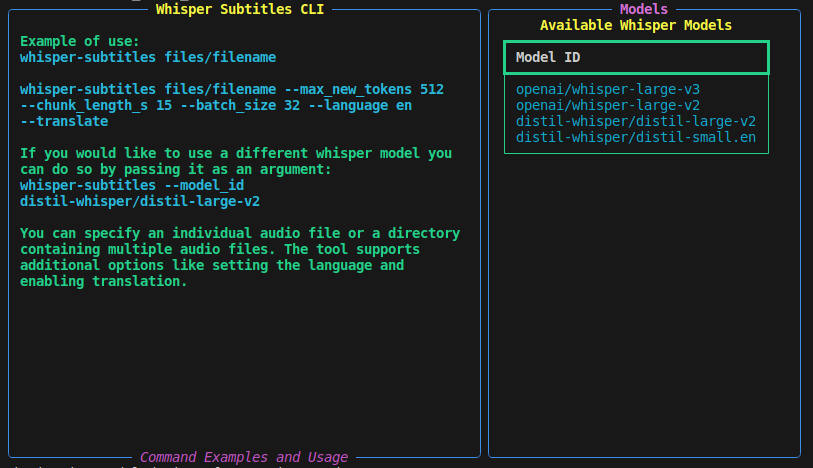

# Whisper Subtitle CLI

Whisper Subtitles is an audio processing tool capable of transcribing and performing speaker diarization on audio files. Utilizing technologies like PyTorch, Hugging Face Transformers, and librosa, this application supports a range of functionalities including translating transcriptions and processing both audio and movie files.


     

## Optimizations

+ Speculative Decoding using distil-whisper as the draft model
+ Low VRAM machines benefit from the inclusion of optimum and bettertransformers.
+ Machines with 3090+ utilize [flash attention 2](https://github.com/Dao-AILab/flash-attention)
+ Pyannote utilized with pytorch lightning. Segmenting takes only 58 seconds for a 30 minute file.

## Prerequisites

Python 3.8-3.11 has been tested. 
Python 3.8 is recommended for fastest response times with flash attention 2


+ Accept [pyannote/segmentation-3.0](https://hf.co/pyannote/segmentation-3.0) user conditions
+ Accept [pyannote/speaker-diarization-3.1](https://hf.co/pyannote-speaker-diarization-3.1)user conditions
+ Create access token at [hf.co/settings/tokens](https://huggingface.co/settings/tokens).

## Installation

Install in editable mode:

```bash
git clone https://github.com/tdolan21/whisper_subtitles.git
cd whisper_subtitles
```
Copy the .env.example and make .env file with your Huggingface Hub access token in it.

```bash
HUGGINGFACE_HUB_TOKEN=your_auth_token
```

Once you have added your auth token you can install with pip:

```bash
pip install -e .
```

## Usage



To use whisper-subtitles, you have several command options to customize the transcription and diarization process. Here are some example usages:

```bash
whisper-subtitles /path/to/directory
whisper-subtitles /path/to/file.mp3
whisper-subtitles /path/to/file.mp4
```
### Customizing Transcription Parameters

You can customize various parameters of the transcription process, like the number of new tokens, chunk length, and batch size:

+ Setting Maximum New Tokens:

```bash
whisper-subtitles /path/to/audiofile --max_new_tokens 512
```
+ Adjusting Chunk Length (seconds):

```bash
whisper-subtitles /path/to/audiofile --chunk_length_s 15
```
+ Specifying Batch Size:

```bash
whisper-subtitles /path/to/audiofile --batch_size 32
```


### Language and Translation Options

You can also specify the language for transcription and enable translation:

+ Specifying Language:

```bash
whisper-subtitles /path/to/audiofile --language en --translate
```

This command enables translation of the transcribed text.

+ Combining Options

You can combine multiple options for finer control:

```bash
whisper-subtitles /path/to/audiofile --max_new_tokens 512 --chunk_length_s 20 --batch_size 16 --language en --translate
```

In this example, the tool transcribes audio with a maximum of 512 new tokens, chunk length of 20 seconds, batch size of 16, sets the translation from Spanish (es) to English (en).

## Speculative Decoding

To initiate the assistant model simply add the flag `--assistant_model_id`.

```bash
whisper-subtitles /path/to/audiofile --model_id openai/whisper-large-v2 --max_new_tokens 512 --chunk_length_s 20 --batch_size 16 --assistant_model_id distil-whisper/distil-large-v2
```
If you have less system memory or VRAM to work with you can also utilize this feature by using smaller models.

```bash
whisper-subtitles /path/to/audiofile --model_id openai/whisper-large-v2 --max_new_tokens 512 --chunk_length_s 20 --batch_size 16 --assistant_model_id distil-whisper/distil-large-v2
```
Another option that can be used for english only tasks, but is likely the most effective combination of small models:

```bash
whisper-subtitles /path/to/audiofile --model_id openai/whisper-medium.en --max_new_tokens 512 --chunk_length_s 20 --batch_size 16 --assistant_model_id distil-whisper/distil-medium.en
```

## Utility Features

Easily verify that your GPU can be utilized properly.


## Performance Test Results

| Whisper Model                  | 2m 30s | 30 min | 90 min |
|--------------------------------|--------|--------|--------|
| openai/whisper-large-v3        | 130s   | TBD    | TBD    |
| openai/whisper-large-v2        | TBD    | TBD    | TBD    |
| distil-whisper/distil-large-v2 | TBD    | TBD    | TBD    |
| distil-whisper/distil-large    | TBD    | TBD    | TBD    |
| distil-whisper/distil-medium.en| TBD    | TBD    | TBD    |
| distil-whisper/distil-small.en | TBD    | TBD    | TBD    |


## Example output

1
00:00:00,000 --> 00:00:01,000
SPEAKER_00:  Foxholes

2
00:00:01,000 --> 00:00:02,500
SPEAKER_00:  Military Tactic

3
00:00:02,500 --> 00:00:04,719
SPEAKER_00:  World War II to present day

4
00:00:00,000 --> 00:00:05,400
SPEAKER_00:  World War I had quickly degenerated into a conflict of mostly static land warfare

5
00:00:05,639 --> 00:00:08,599
SPEAKER_00:  based around extensive networks of defensive trenches.

6
00:00:00,000 --> 00:00:03,080
SPEAKER_00:  These were elaborate fortifications that were semi-permanent

7
00:00:03,080 --> 00:00:05,759
SPEAKER_00:  and took a great deal of time and effort to construct,

8
00:00:06,000 --> 00:00:08,679
SPEAKER_00:  as well as a fair degree of engineering expertise.

## Citations

```bibtex
@inproceedings{Plaquet23,
  author={Alexis Plaquet and Hervé Bredin},
  title={{Powerset multi-class cross entropy loss for neural speaker diarization}},
  year=2023,
  booktitle={Proc. INTERSPEECH 2023},
}
```

```bibtex
@inproceedings{Bredin23,
  author={Hervé Bredin},
  title={{pyannote.audio 2.1 speaker diarization pipeline: principle, benchmark, and recipe}},
  year=2023,
  booktitle={Proc. INTERSPEECH 2023},
}
```

```bibtex
@misc{gandhi2023distilwhisper,
      title={Distil-Whisper: Robust Knowledge Distillation via Large-Scale Pseudo Labelling}, 
      author={Sanchit Gandhi and Patrick von Platen and Alexander M. Rush},
      year={2023},
      eprint={2311.00430},
      archivePrefix={arXiv},
      primaryClass={cs.CL}
}
```

```bibtex
@misc{radford2022whisper,
  doi = {10.48550/ARXIV.2212.04356},
  url = {https://arxiv.org/abs/2212.04356},
  author = {Radford, Alec and Kim, Jong Wook and Xu, Tao and Brockman, Greg and McLeavey, Christine and Sutskever, Ilya},
  title = {Robust Speech Recognition via Large-Scale Weak Supervision},
  publisher = {arXiv},
  year = {2022},
  copyright = {arXiv.org perpetual, non-exclusive license}
}
```